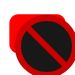

# Always New To You — YouTube Smart Blacklister

<p align="center">
  
</p>

<p align="center">
  <strong>Permanently un-break your YouTube feed.</strong><br>
  A high-performance Manifest V3 browser extension with server-invisible channel blacklisting, instant thumbnail quick-blocking, intelligent keyword filtering, and automated feed replenishment.
</p>

<p align="center">
  <a href="https://github.com/PyrateGFXProductions/YouTube-Blacklister/releases"></a>
  <a href="https://developer.chrome.com/docs/extensions/mv3/intro/"></a>
  <a href="LICENSE"></a>
  <a href="#privacy--offline-security"></a>
  <a href="https://ko-fi.com/pyrategfxproductions"></a>
</p>

<p align="center">
  <a href="https://ko-fi.com/pyrategfxproductions">
    
  </a>
</p>

---

## Table of Contents
- [The Problem: The YouTube Server Cache Trap](#the-problem-the-youtube-server-cache-trap)
- [How Always New To You Solves It](#how-always-new-to-you-solves-it)
- [Key Features](#key-features)
- [Extension Popup Tour](#extension-popup-tour)
- [Installation Guide](#installation-guide)
- [Usage & Quick Start](#usage--quick-start)
- [Technical Architecture & Under the Hood](#technical-architecture--under-the-hood)
- [Support the Project & Donations](#support-the-project--donations)
- [Changelog & Versioning](#changelog--versioning)
- [Contributing](#contributing)
- [License & Credits](#license--credits)

---

## The Problem: The YouTube Server Cache Trap

Have you ever used YouTube's native **"Not Interested"** or **"Don't recommend channel"** buttons on the **"New to You"** discovery feed, only to have your homepage run completely dry?

```
Native YouTube Behavior (The Depletion Trap):
┌─────────────────────────┐
│ YouTube Server Cache    │
│ [Batch of ~24 videos]   │
└────────────┬────────────┘
             │
             ├─ User clicks "Don't recommend channel" (Sends POST to YouTube)
             ├─ YouTube marks video as consumed on the server
             ├─ YouTube DOES NOT replenish the batch!
             ▼
┌─────────────────────────┐
│ The Result: DEAD FEED   │
│ Refreshing page? Same!  │
│ 1-2 hour cooldown lock! │
└─────────────────────────┘
```

When you click YouTube's native dismissal buttons, YouTube's server immediately marks those slots as consumed without fetching a replacement batch. Your client is trapped with a depleted server-side recommendation queue for **1 to 2 hours**. Refreshing the page, toggling "All", or cache-busting does nothing because the server simply re-serves the depleted cached batch.

---

## How Always New To You Solves It

**Always New To You** operates entirely on the client side inside the browser's DOM:

1. **100% Server-Invisible Filtering**: Videos and channels are filtered instantly in the DOM. YouTube's recommendation servers are **never** notified, meaning your server recommendation queue remains intact and your feed never enters a cooldown lockout.
2. **Auto-Pinning "New to You"**: Automatically selects and maintains YouTube's "New to You" discovery chip as you browse, ensuring you are constantly exposed to fresh creators.
3. **Automated Feed Replenishment**: When multiple hidden videos deplete visible rows below an optimal threshold, a gentle, non-disruptive scroll trigger prompts YouTube to pull the next chunk down the pipe.
4. **Watch-Page Isolation**: Filtering strictly targets feed lockups and search grids (`ytd-rich-item-renderer`, `yt-lockup-view-model`). Player wrappers (`ytd-watch-flexy`, metadata panels) are strictly isolated so video playback is never disrupted.

---

## Key Features

### ⚡ Zero-Latency Local Blacklist
- Hide channels instantly with zero network delay.
- Cleanly matches channel names, `@handles`, and video link formats.
- Persistent offline storage via `chrome.storage.local`.

### 🎯 1-Click Thumbnail Quick-Block
- Hover over any video thumbnail on YouTube to reveal a dedicated quick-block button.
- Dismiss unwanted channels in a fraction of a second without navigating nested dropdown menus.
- Can be toggled on/off in Settings.

### 📋 Seamless 3-Dot Menu Integration
- Injects a native-styled **"Blacklist Channel (Local)"** action directly into YouTube's 3-dot context menu.
- Deep-clones native renderer contexts to guarantee the action renders enabled, clickable, and responsive across YouTube redesigns.

### 🔄 Virtual Scroller & DOM Recycling Resilient
- YouTube recycles DOM containers as you scroll through infinite feeds.
- The extension tracks unique video signatures rather than simple static tags, ensuring recycled elements are re-evaluated accurately on the fly.

### 🛡️ Smart Word-Boundary & Regex Keyword Engine
- Block annoying video tropes, clickbait buzzwords, or spoilers.
- **Word-boundary aware**: Blocking `"cat"` will hide `"cute cat"` but **will not** hide `"category"` or `"catastrophe"`.
- **Regex support**: Full support for regular expressions with flags (e.g. `/vlog\s*#?\d+/i`, `/unboxing/i`).

### ⭐ Whitelist Channel Safeguards
- Whitelist favorite channels so they are **never blocked**, even if their video title matches an active keyword rule (e.g., allow your favorite tech reviewer even if you blocked the word `"crypto"`).

### 🚫 Feed Decluttering Toggles
- **Hide YouTube Shorts**: Completely remove Shorts shelves and compact Shorts reels from your home and subscription feeds.
- **Hide Community Posts**: Eliminate text posts, polls, and image promotions from your feed.

### 📊 Real-Time Badging & All-Time Stats
- The extension badge displays the number of hidden videos on your active tab in real time.
- Lifetime counter tracks all-time blocked videos.

### 💾 Complete Data Portability (JSON Backup)
- Export your entire rule set, keywords, whitelist, and settings to a JSON file with one click.
- Import backups effortlessly to sync rules across multiple computers or browsers.

---

## Extension Popup Tour

The extension features a responsive, dark-themed management popup designed to feel right at home alongside YouTube's native styling:

```
┌─────────────────────────────────────────────────────┐
│ 📺 YouTube Blacklister             [ 142 Blocked ] │
├──────────────┬──────────────┬─────────────┬─────────┤
│ Channels (8) │ Keywords (3) │ Whitelist(2)│ Settings│
├──────────────┴──────────────┴─────────────┴─────────┤
│ 🔍 Search blacklisted channels...                   │
│ ┌─────────────────────────────────────────────────┐ │
│ │ Clickbait Channel Name               [ Unblock ]│ │
│ │ @spam_creator                        [ Unblock ]│ │
│ │ AI Reactions HD                      [ Unblock ]│ │
│ └─────────────────────────────────────────────────┘ │
│ [ Enter channel name, @handle, or URL...  ] [ Add ] │
├─────────────────────────────────────────────────────┤
│ Ready • v1.5.2                 [ ☕ Support on Ko-fi ]│
└─────────────────────────────────────────────────────┘
```

- **Channels Tab**: View, search, and unblock blacklisted channels. Add channels by name, `@handle`, or direct video URL. Bulk entry supported (comma or newline separated).
- **Keywords Tab**: Add and search word-boundary keywords or `/pattern/flags` regular expressions.
- **Whitelist Tab**: Safeguard trusted channels against broad keyword rules.
- **Settings & Tools Tab**: Toggle the hover quick-block button, Shorts blocker, and Community posts blocker. Export and import JSON backups.

---

## Installation Guide

### Option 1: Load Unpacked (Chrome, Edge, Brave, Opera, Vivaldi)

1. **Download or Clone the Repository**:
   ```bash
   git clone https://github.com/PyrateGFXProductions/YouTube-Blacklister.git
   ```
   *(Or download the ZIP from [Releases](https://github.com/PyrateGFXProductions/YouTube-Blacklister/releases) and extract it to a folder).*

2. **Open your browser's Extension Manager**:
   - **Google Chrome**: Navigate to `chrome://extensions`
   - **Microsoft Edge**: Navigate to `edge://extensions`
   - **Brave**: Navigate to `brave://extensions`
   - **Opera / Vivaldi**: Open Settings → Extensions

3. **Enable Developer Mode**:
   - Toggle the **Developer mode** switch in the top-right corner.

4. **Load the Extension**:
   - Click the **Load unpacked** button in the top-left corner.
   - Select the `YouTube-Blacklister` folder containing `manifest.json`.

5. **Pin the Extension**:
   - Click the puzzle piece icon in your browser toolbar and pin **Always New To You**.

---

## Usage & Quick Start

1. Navigate to [https://www.youtube.com](https://www.youtube.com).
2. Notice the **"New to You"** chip is automatically selected and held active.
3. When an unwanted channel appears:
   - **Method A (1-Click Hover)**: Hover your mouse over the video thumbnail and click the red **"✕ Block Channel"** badge in the upper corner.
   - **Method B (3-Dot Menu)**: Click the **3 dots (⋮)** on the video card and select **"Blacklist Channel (Local)"** at the very top.
4. The channel's videos disappear from your feed instantly with a confirmation toast.
5. Click the extension toolbar icon at any time to review your list, adjust keywords, or export your configuration.

---

## Technical Architecture & Under the Hood

Modern YouTube does not use static HTML tables or standard server-rendered feeds. Instead, it employs:
- **Polymer / Web Components** (`ytd-rich-grid-renderer`, `ytd-rich-item-renderer`, `yt-lockup-view-model`)
- **Innertube JSON Endpoint APIs** (`/youtubei/v1/browse`, `/youtubei/v1/search`)
- **DOM Virtualization and Recycle Pools** (reusing existing DOM nodes as the viewport scrolls)

### How We Overcame YouTube's Modern Architecture:

1. **Renderer Context Deep-Cloning**:
   In modern YouTube UI releases, injecting a standard HTML `<button>` or a bare `yt-list-item-view-model` results in an inert, disabled row. YouTube requires an active `rendererContext` carrying a recognized command endpoint. We deep-clone the native row's context and supply an inert `feedbackEndpoint` with `sendPost: false`, rendering the item active and styled correctly while **guaranteeing zero network requests** are dispatched to YouTube.

2. **Innertube Hook & DOM Fallback Dual Pipeline**:
   The extension hooks into the `window.fetch` pipeline for innertube JSON responses to inject the menu option at the data layer, while simultaneously running a robust DOM mutation observer fallback to handle legacy lockups and delayed rendering.

3. **Virtual DOM Element Recycling**:
   Unlike basic content scripts that stamp a `data-processed="true"` attribute on elements and forget them, Always New To You checks a computed content fingerprint (`title + channel + href`). When YouTube recycles an existing DOM wrapper for a completely different video, the extension re-evaluates the card instantaneously.

4. **Exception-Shielded Async Architecture**:
   Chrome disables extensions if an unhandled promise rejection occurs during network hooks. Every async operation, fetch interceptor, and mutation callback in this extension is wrapped in defensive exception guards.

---

## Privacy & Offline Security

- **Zero External Connections**: The extension communicates only with `chrome.storage.local` on your device.
- **No Analytics or Telemetry**: No trackers, no logging services, no third-party libraries.
- **Minimal Permissions**: Requests only `"storage"` (to remember your blocked rules) and `"tabs"` (to notify open YouTube tabs when rules change).
- **Inspectable Source**: Every line of code is human-readable Vanilla JavaScript and CSS.

---

## Support the Project & Donations

This extension is 100% free and open-source under the MIT license. 

YouTube updates its web frontend and internal class selectors multiple times each month. Keeping this extension perfectly resilient, updated, and feature-rich requires constant testing and development.

If this extension has saved your YouTube experience from algorithm fatigue and endless clickbait, please consider supporting development:

<p align="center">
  <a href="https://ko-fi.com/pyrategfxproductions">
    
  </a>
</p>

- ☕ **Ko-fi**: [https://ko-fi.com/pyrategfxproductions](https://ko-fi.com/pyrategfxproductions)
- ⭐ **GitHub Star**: Star this repository to help others discover the project!
- 🐛 **Feedback**: Open an issue if you encounter a new YouTube layout variation or have a feature idea.

Every coffee and contribution directly fuels ongoing updates, selector maintenance, and new features!

---

## Packaging for Release

To create a clean, distributable ZIP archive for GitHub Releases or Chrome Web Store:

```powershell
.\package-extension.ps1
```

This PowerShell script validates your manifest, confirms that all icons and required assets exist, and builds `YouTube-Blacklister-v1.5.2.zip`.

---

## Changelog & Versioning

See [CHANGELOG.md](CHANGELOG.md) for full release history and version notes.

---

## Contributing

Contributions, bug reports, and suggestions are warmly welcomed! Please read our [CONTRIBUTING.md](CONTRIBUTING.md) guide before submitting pull requests.

---

## License & Credits

Created and maintained by **[PyrateGFX Productions](https://github.com/PyrateGFXProductions)**.

Released under the **[MIT License](LICENSE)**.
Feel free to use, modify, and distribute this project freely.
